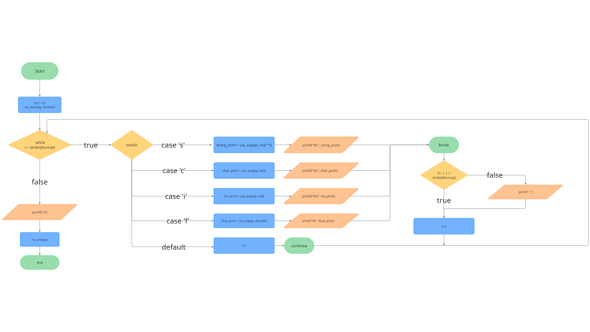

# print all function

## the print all function is a function that cant print all type of variable with one function

## usage

```c
print_all("fcsi", 3.14435, 'H', "hello word", 402);
```

the actual usage is `print_all(format, ...)`
format is the indicator of the number, and the type of the variable to be printed,
it can be :

| caractere | type |
|---|-----|
| c | char |
| i | integer |
| f | float |
| s | string |

you have to put the caractere in the order of the variable

## Flowchart


